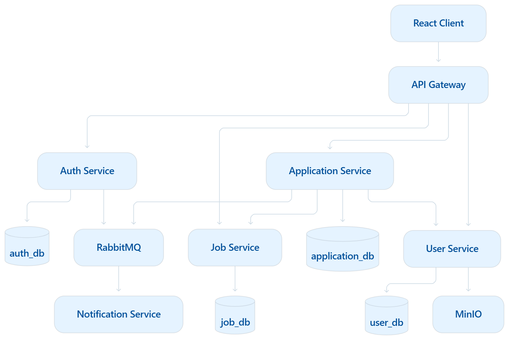
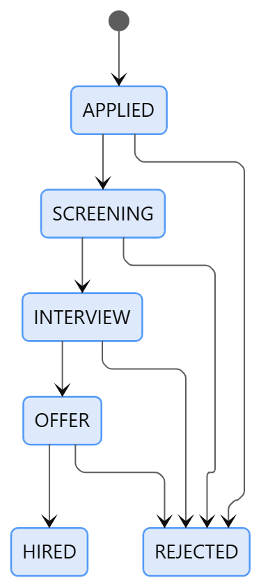

# 01 — System Overview

## 1. Mục tiêu và phạm vi MVP

Xây dựng nền tảng tuyển dụng kết nối **Candidate**, **Employer** và **Admin** theo kiến trúc Microservices.

- Candidate: quản lý hồ sơ/CV, tìm Job, ứng tuyển và theo dõi trạng thái.
- Employer: quản lý Company, Job và hồ sơ ứng tuyển.
- Admin: quản lý tài khoản, Category, Location và giám sát hệ thống.
- Ngoài MVP: thanh toán, chat, video interview, AI matching, OAuth2 và duyệt mọi Job.

## 2. Kiến trúc tổng thể



## 3. Công nghệ

| Thành phần | Công nghệ |
|---|---|
| Backend | Java, Spring Boot, Spring Security, Spring Data JPA |
| Gateway | Spring Cloud Gateway |
| Database | PostgreSQL — database per service |
| Token/cache | Redis |
| Message broker | RabbitMQ |
| File storage | MinIO |
| Frontend | React, Vite, Tailwind, TanStack Query |
| Runtime | Docker Compose; Kubernetes ở giai đoạn sau |
| Contract/migration | OpenAPI, Flyway |

## 4. Nguyên tắc kiến trúc

- Client chỉ truy cập qua API Gateway.
- Mỗi service sở hữu database riêng; không đọc trực tiếp DB của service khác.
- Không tạo foreign key xuyên database; dùng logical ID.
- Gateway xác thực JWT; domain service vẫn kiểm tra role và ownership.
- Service HTTP stateless; file lưu trên object storage.
- REST dùng khi cần kết quả ngay; RabbitMQ dùng cho email/thông báo.
- Lời gọi liên service phải có timeout; retry chỉ khi an toàn/idempotent.

## 5. Trạng thái cốt lõi

```text

```

## 6. Bảo mật

- BCrypt cho password; Access Token 15–30 phút; Refresh Token khoảng 7 ngày.
- JWT chứa `userId`, `email`, `role`, `iat`, `exp`; không chứa dữ liệu nhạy cảm.
- API đăng ký công khai chỉ nhận `CANDIDATE` hoặc `EMPLOYER`.
- Service nội bộ không mở public port trong production.
- CV chỉ nhận PDF theo giới hạn; client gửi `cvId`, không tự khai báo `cvUrl`.
- Secret không commit vào Git.

## 7. Yêu cầu phi chức năng

- Mục tiêu test: p95 read API đơn giản < 300 ms; write API < 500 ms, không tính file/email.
- Chuẩn hóa error response; không lộ stack trace.
- Health check, structured log, correlation/trace ID.
- Unit test và integration test cho nghiệp vụ quan trọng.
- Schema quản lý bằng Flyway; không dùng `ddl-auto=update` ở production.

## 8. Hoàn thành MVP khi

- Register/login/refresh hoạt động.
- Candidate quản lý profile/CV và tìm Job.
- Employer quản lý Company/Job đúng ownership.
- Apply kiểm tra Job, CV và chống trùng ở database.
- Chuyển trạng thái Application đúng workflow và lưu history.
- RabbitMQ và Notification Service hoạt động.
- Hệ thống chạy được bằng Docker Compose.

