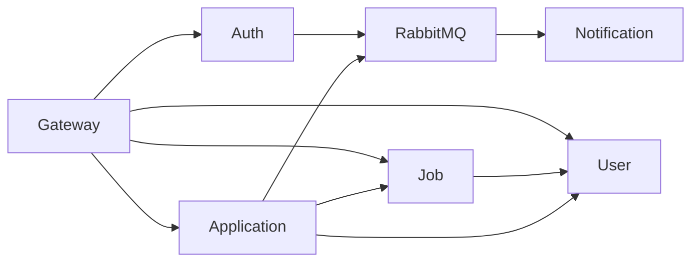

# 02 — Service Boundaries

## 1. Ma trận service

| Service | Trách nhiệm | Dữ liệu sở hữu | Phụ thuộc |
|---|---|---|---|
| `api-gateway` | Routing, JWT ở biên, CORS, rate limit, correlation ID | Không có DB nghiệp vụ | Các HTTP service |
| `auth-service` | Credential, role, login, token, account status | User, refresh token | Redis, RabbitMQ |
| `user-service` | Candidate profile, Company/member, CV metadata | Profile, Company, CV | MinIO |
| `job-service` | Job, Category, Location, search/filter | Job và danh mục | User Service khi xác minh Company |
| `application-service` | Apply, chống trùng, trạng thái, history | Application, snapshot | Job, User, RabbitMQ |
| `notification-service` | Email, idempotent event handling | Notification log | RabbitMQ, mail provider |

## 2. Ranh giới trách nhiệm

### Auth Service

- Đăng ký `CANDIDATE`/`EMPLOYER`; xác minh password; phát/refresh/revoke token; khóa tài khoản.
- Publish `USER_REGISTERED`.
- Không lưu profile, Company, CV hoặc quyết định resource ownership.

### User Service

- Quản lý Candidate profile, Company, `company_members`, CV metadata và MinIO.
- Xác nhận CV thuộc Candidate; Employer có quyền quản lý Company.
- Không lưu password/token, Job hoặc Application.

### Job Service

- CRUD/publish/close Job; search, filter, pagination; Category/Location.
- Xác minh Employer được quản lý Job thông qua Company ownership.
- Không lưu Application/CV và không đọc `user_db` trực tiếp.

### Application Service

- Kiểm tra Job qua Job Service và CV qua User Service.
- Tạo Application, unique `(candidate_id, job_id)`, snapshot, state transition và history.
- Publish application events; không gửi email trực tiếp trong transaction.

### Notification Service

- Consume event, chống trùng bằng `eventId`, gửi email, retry và DLQ.
- Không thay đổi trạng thái Application.

## 3. Dependency hợp lệ

Không tạo vòng gọi đồng bộ. Service chỉ chia sẻ DTO contract, không chia sẻ JPA Entity.

## 4. Ownership authorization

| Hành động | Điều kiện |
|---|---|
| Sửa Candidate profile/CV | `jwt.userId == resource.userId` |
| Sửa Company | User là Company member có quyền quản lý |
| Sửa/đóng Job | Employer quản lý `job.companyId` |
| Apply Job | Candidate; CV thuộc mình; Job đang mở |
| Xem/cập nhật Application | Employer quản lý Job tương ứng |
| Quản lý Category/Location | Admin |

## 5. Contract liên service

| Consumer | Provider | Contract |
|---|---|---|
| Job | User | Kiểm tra quyền quản lý Company |
| Application | Job | Job eligibility và Job/owner snapshot |
| Application | User | CV ownership và CV/Candidate snapshot |
| Notification | RabbitMQ | Application/User events |

