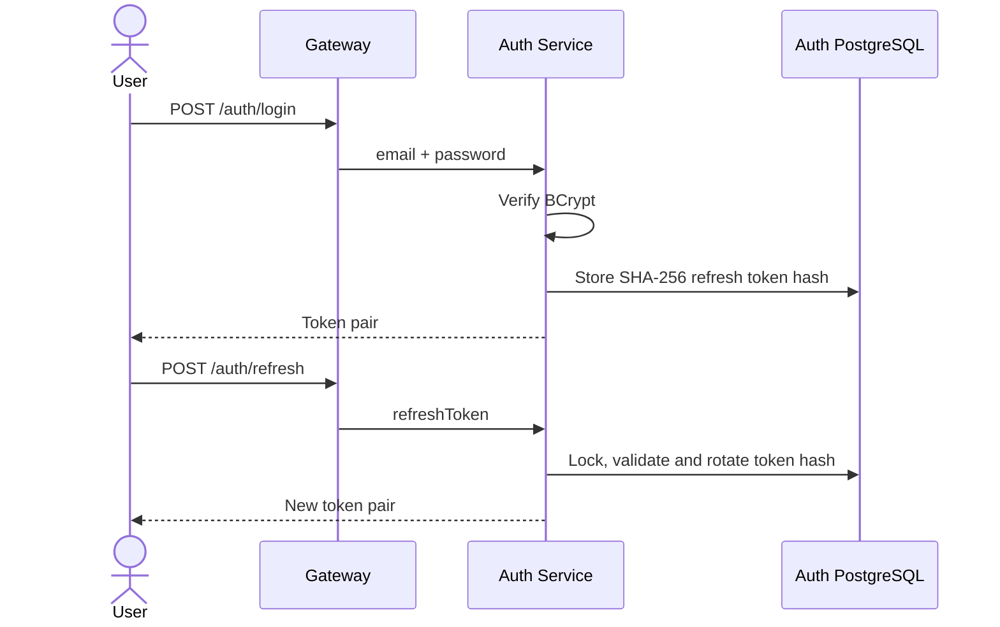
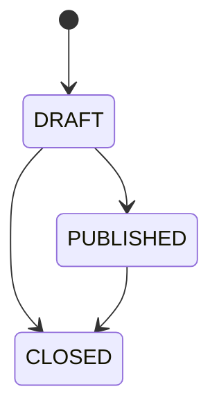

# 03 — Business Workflows

## 1. Đăng ký và đăng nhập

### Register

1. Client gửi `email`, `password`, `role`.
2. Auth Service chỉ chấp nhận Candidate/Employer, kiểm tra email/password policy.
3. Hash BCrypt, tạo User và publish `USER_REGISTERED`.
4. User Service consume event và tạo profile rỗng; consumer retry/DLQ nếu lỗi.

### Login/refresh

Refresh Token của MVP là opaque token. Raw token chỉ được trả cho client; Auth Service lưu SHA-256 hash trong PostgreSQL. Redis được dành cho rate limiting, cache hoặc token blacklist ở task sau.

## 2. Employer đăng Job

1. Employer hoàn thiện Company.
2. Tạo Job ở `DRAFT`; Job Service xác minh Company ownership.
3. Employer cập nhật và publish Job khi đủ dữ liệu.
4. Job chuyển `CLOSED` khi đóng hoặc hết hạn.

## 3. Candidate tìm Job

- Chỉ trả Job `PUBLISHED` và chưa hết hạn.
- Filter: `keyword`, `locationId`, `categoryId`, `salaryMin`.
- Có pagination; mặc định sort `createdAt,desc`.

## 4. Candidate nộp hồ sơ

Quy tắc: Candidate hợp lệ; Job đang mở; CV thuộc Candidate; unique `(candidate_id, job_id)`; apply trùng trả `409`; email lỗi không rollback Application.

## 5. Employer xử lý Application

1. Xác minh Employer quản lý Job của Application.
2. Kiểm tra transition, cập nhật Application và ghi history.
3. Publish `APPLICATION_STATUS_CHANGED`.

`REJECTED` và `HIRED` là trạng thái kết thúc trong MVP.

## 6. Notification

Event gồm `eventId`, `eventType`, `occurredAt`, `data`. Consumer kiểm tra `eventId`, gửi email, ghi kết quả; lỗi tạm thời retry có giới hạn, sau đó chuyển DLQ.

## 7. Lỗi nghiệp vụ

| Tình huống | HTTP/code |
|---|---|
| Email tồn tại | `409 EMAIL_ALREADY_EXISTS` |
| Sai thông tin đăng nhập | `401 INVALID_CREDENTIALS` |
| Sai role/ownership | `403 ACCESS_DENIED` / `RESOURCE_FORBIDDEN` |
| Không tìm thấy tài nguyên | `404 ..._NOT_FOUND` |
| Apply trùng | `409 APPLICATION_ALREADY_EXISTS` |
| Transition sai | `409 INVALID_STATUS_TRANSITION` |
| Dependency timeout | `503 DEPENDENCY_UNAVAILABLE` |
